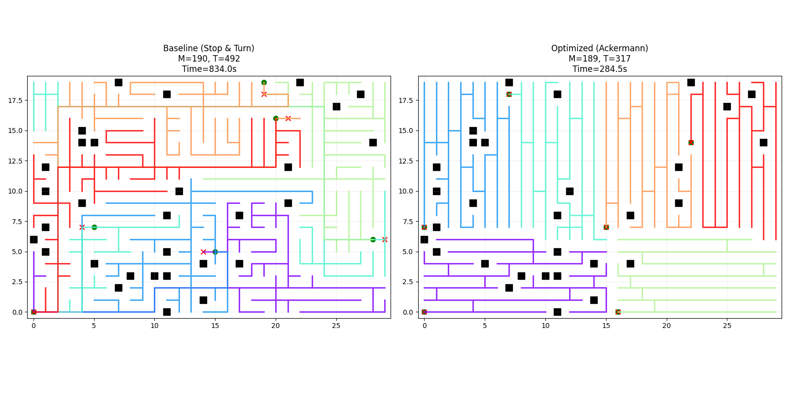
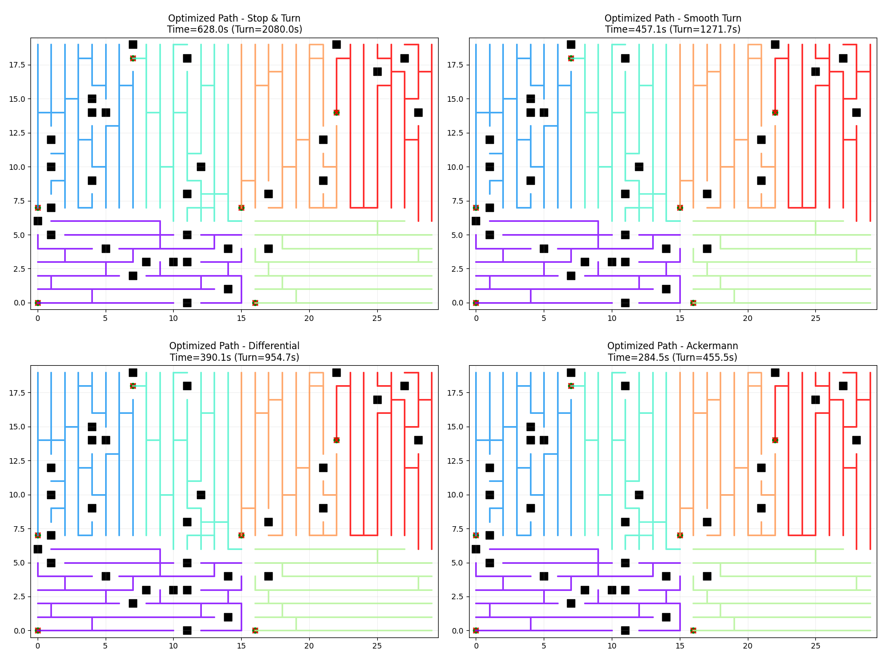

# Optimized Multi-Robot Coverage Path Planning (MCPP)

This project implements a high-performance solution for the Multi-Robot Coverage Path Planning problem. It outperforms standard baseline approaches by significantly reducing the number of turns while maintaining an optimal makespan.

## Problem Statement
Given a grid map with obstacles and $k$ robots, find $k$ paths such that:
1.  Every free cell is visited at least once.
2.  The **Makespan** (time to complete coverage) is minimized.
3.  The **Total Turns** are minimized (crucial for robot efficiency).

## Approach: Divide and Conquer

We use a two-stage strategy that is superior to the "Single Path Split" baseline:

### 1. Partitioning: Recursive Coordinate Bisection (RCB)
Instead of generating one giant path and cutting it, we first partition the grid into $k$ balanced regions.
-   **Algorithm**: Recursively splits the grid along the longest axis at the median point.
-   **Benefit**: Guarantees that each robot gets an equal number of cells ($\pm 1$), ensuring optimal theoretical makespan.

### 2. Path Planning: Biased Spanning Tree (BST)
For each region, we generate a coverage path that minimizes turns.
-   **Algorithm**: Constructs a Minimum Spanning Tree (MST) with edge weights biased towards straight lines (horizontal or vertical).
-   **Benefit**: Creates "scanning" (boustrophedon) patterns naturally, avoiding the random zig-zags of standard MSTs.
-   **Refinement**: A fast Local Search (2-opt) is applied to smooth out any remaining inefficiencies.

## Results

### 1. Algorithmic Impact (Path Planning Strategy)
*Comparison using the same "Stop & Turn" motion model to isolate the benefit of the path planning algorithm.*

| Metric | Baseline (Single Path Split) | Optimized (Divide & Conquer) | Improvement |
| :--- | :--- | :--- | :--- |
| **Total Turns** | 492 | **317** | **~36% Reduction** |
| **Total Time** | 834.00s | **628.00s** | **~25% Faster** |
| **Turn Time** | 3248.00s | **2080.00s** | **~36% Less Waiting** |

### 2. Kinematic Impact (Hardware Capabilities)
*Comparison of the SAME Optimized Path under different motion models to show the benefit of agile robots.*

| Kinematic Model | Total Time | Turn Time | Improvement vs Baseline |
| :--- | :--- | :--- | :--- |
| **Stop & Turn** | 628.00s | 2080.00s | 25% |
| **Smooth Turn** | 457.09s | 1271.74s | 45% |
| **Differential** | 390.09s | 954.74s | 53% |
| **Ackermann** | **284.49s** | **455.53s** | **66%** |

*(Results based on a 30x20 grid with 6 robots)*

## Visual Comparison

| Baseline vs. Optimized | Kinematic Model Comparison |
| :---: | :---: |
| **`mcpp_comparison.png`** | **`all_turn_comparison.png`** |
|  |  |
| *Comparison of path topology. Note the chaotic turns in Baseline vs. structured scanning in Optimized.* | *Performance of the optimized path under different kinematic constraints (Stop & Turn, Smooth, Differential, Ackermann).* |

## Installation

Requires Python 3.8+ and the following libraries:

```bash
pip install numpy networkx matplotlib
```

## Usage

Run the main script to execute the comparison experiment:

```bash
python optimized_mcpp.py
```

This will:
1.  Generate a random grid with obstacles.
2.  Run the Baseline algorithm.
3.  Run the Optimized algorithm.
4.  Print metrics to the console and `results.txt`.
5.  Save visualization comparisons to `mcpp_comparison.png` and `all_turn_comparison.png`.

## File Structure

-   `optimized_mcpp.py`: Main script containing the `OptimizedMCPP` solver and comparison logic.
-   `results.txt`: Output file containing the latest run metrics.
-   `mcpp_comparison.png`: Visualization of Baseline vs. Best Optimized path.
-   `all_turn_comparison.png`: Visualization of Optimized path under all kinematic models.
